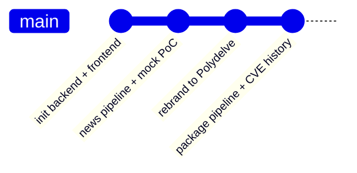
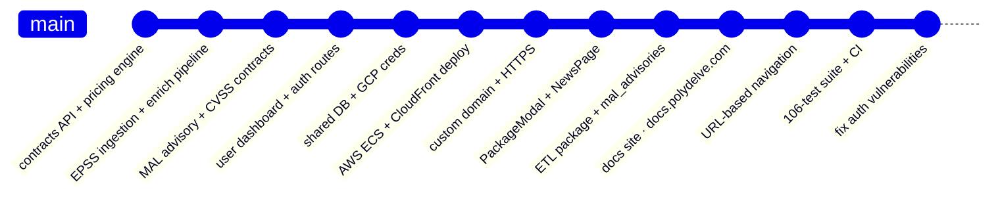

# Polydelve

Prediction markets for software security risk. Open contracts on whether a package gets a new CVE, crosses an EPSS threshold, or lands on the KEV list. Built as a research and demo platform for exploring exploit-signal forecasting over the npm and PyPI ecosystems.

Live at [polydelve.com](https://polydelve.com) · Docs at [docs.polydelve.com](https://docs.polydelve.com)

## Features

- **CVE tracking** — monitor packages across npm and PyPI for known vulnerabilities
- **EPSS trend charts** — exploitation probability over time with CVE scatter overlay
- **Exploit signals** — OSV malicious advisory detection, PoC and active exploit flags
- **Prediction markets** — open contracts on security events; Schmeckle-denominated, no real money
- **Leaderboard** — users ranked by prediction accuracy

## Stack

| Layer    | Tech                                                         |
| -------- | ------------------------------------------------------------ |
| Frontend | React, Vite, TypeScript, Tailwind, Shadcn, Recharts          |
| Backend  | FastAPI, Python 3.14, DuckDB                                 |
| Database | MotherDuck (serverless DuckDB cloud)                         |
| Infra    | AWS ECS Fargate, CloudFront, S3, Step Functions, EventBridge |
| Auth     | Auth0                                                        |

## Repo layout

```
polydelve/
├── backend/
│   ├── main.py                  # FastAPI app entry point
│   ├── config.py                # env/settings
│   ├── api/
│   │   ├── auth.py              # Auth0 JWT validation
│   │   ├── cache.py             # response caching
│   │   ├── middleware/          # CORS, auth middleware
│   │   └── routes/
│   │       ├── contracts.py     # prediction market contract CRUD
│   │       ├── packages.py      # package search + CVE data
│   │       ├── prediction_market.py  # bet placement + resolution
│   │       ├── users.py         # user profile + Schmeckle balance
│   │       └── health.py
│   ├── etl/
│   │   ├── fetch/               # data source fetchers (CVE, EPSS, news, mal, sectors)
│   │   └── jobs/                # scheduled ETL jobs (epss, mal, news, packages)
│   ├── models/                  # Pydantic models
│   ├── features/                # feature engineering (EPSS signals, risk scoring)
│   └── tests/                   # pytest suite
├── frontend/
│   └── src/
│       ├── App.tsx              # router + layout
│       ├── components/          # all pages and UI components
│       │   ├── PackagesTable.tsx     # main package list
│       │   ├── PackageModal.tsx      # package detail drawer
│       │   ├── PredictPage.tsx       # market browsing + betting
│       │   ├── DashboardPage.tsx     # user portfolio
│       │   ├── LeaderboardTable.tsx
│       │   ├── NewsPage.tsx
│       │   └── AdminPage.tsx
│       ├── lib/                 # API client, auth hooks, utils
│       └── types.ts             # shared TypeScript types
├── terraform/                   # AWS infra (ECS, CloudFront, S3, IAM, ECR)
├── scripts/                     # deploy-backend.sh, deploy-frontend.sh
├── docs/                        # Docusaurus docs site
└── Makefile                     # all dev commands
```

## Local dev

```bash
make install    # install all deps (uv + npm)
make dev        # backend :8000 + frontend :5173
make docs       # docs site :3001
make help       # full target list
```

Backend requires `backend/.env` — copy from `.env.example` and fill in MotherDuck token, Auth0 config, and GCP credentials path.

## Key data flows

**Package data**: `etl/jobs/packages.py` → fetches npm/PyPI metadata + OSV CVEs → MotherDuck  
**EPSS scores**: `etl/jobs/epss.py` → BigQuery bulk export (never loop FIRST API) → MotherDuck  
**Malicious advisories**: `etl/jobs/mal.py` → OSV malicious advisories → MotherDuck  
**Prediction markets**: `api/routes/contracts.py` + `prediction_market.py` → DuckDB ACID via MotherDuck

## Auth

Auth0 JWT. `api/auth.py` validates tokens. Protected routes use `Depends(get_current_user)`. Frontend uses Auth0 React SDK; tokens attached in `lib/api.ts`.

## Deployment

Backend: Docker → ECR → ECS Fargate (`scripts/deploy-backend.sh`)  
Frontend: `npm run build` → S3 → CloudFront (`scripts/deploy-frontend.sh`)  
Infra: `terraform/` — apply from repo root with `terraform -chdir=terraform apply`

> **Note**: ECS service `polydelve-backend-v2` defaults to 0 tasks in non-prod. Scale to 1 before testing the live API.

## Tests

```bash
make test       # backend pytest
make fe-test    # frontend vitest
make ci         # both
```

106 tests total. Backend tests use a separate `polydelve.test.duckdb` fixture, not MotherDuck.

---

## Changelog

### Week 1 · May 25–26



### Week 2 · Jun 1–8


