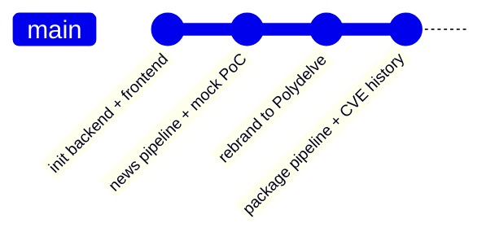
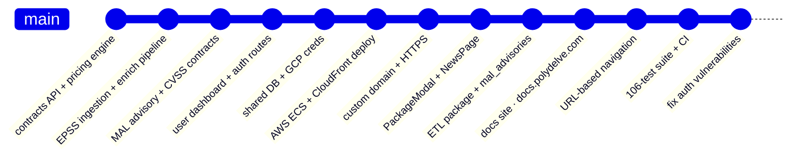
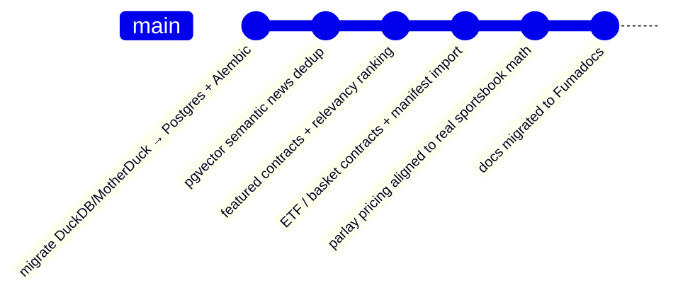

# Polydelve

Prediction markets for software supply-chain risk. Open contracts on whether a package gets a new CVE above a CVSS threshold, crosses an EPSS threshold, or picks up a malicious-package (MAL) advisory — plus ETF contracts that bundle multiple packages into one basket bet. Built as a research and demo platform for exploring exploit-signal forecasting over the npm, PyPI, and Composer ecosystems.

Live at [polydelve.com](https://polydelve.com) · Docs at [docs.polydelve.com](https://docs.polydelve.com)

## Features

- **CVE tracking** — tracks the npm/PyPI/Composer candidate universe (no fixed package cap) against the OSV advisory database
- **EPSS trend charts** — exploitation probability over time with CVE scatter overlay
- **Exploit signals** — OSV malicious-package advisory detection, PoC and active-exploit flags
- **Prediction markets** — contracts resolve on CVE+CVSS, EPSS threshold, or MAL advisory; Schmeckle-denominated, no real money
- **ETFs** — basket contracts across a manifest of multiple packages, with a configurable "at least K of N legs" win condition, priced like a real parlay (payout = stake / P(outcome))
- **Leaderboard** — users ranked by Schmeckle balance

## Stack

| Layer    | Tech                                                          |
| -------- | -------------------------------------------------------------- |
| Frontend | React, Vite, TypeScript, Tailwind, Recharts                    |
| Backend  | FastAPI, Python 3.14, psycopg2                                  |
| Database | PostgreSQL 16 (RDS in prod, Docker locally), Alembic migrations |
| Infra    | AWS ECS Fargate (Express Gateway), CloudFront, S3, EventBridge Scheduler |
| Auth     | Auth0                                                           |
| Docs     | Fumadocs (Next.js)                                              |

## Repo layout

```
polydelve/
├── backend/
│   ├── main.py                  # FastAPI app entry point
│   ├── config.py                # env/settings
│   ├── alembic/                 # schema migrations
│   ├── api/
│   │   ├── auth.py              # Auth0 JWT validation
│   │   ├── cache.py             # response caching
│   │   └── routes/
│   │       ├── contracts.py     # single-package contract CRUD + simulate
│   │       ├── etf.py           # basket (ETF) contracts: parse manifest, quote, simulate, buy
│   │       ├── packages.py      # package search + CVE/EPSS data
│   │       ├── prediction_market.py  # market/featured-contract browsing
│   │       ├── featured.py      # featured contracts feed
│   │       ├── users.py         # user profile, Schmeckle balance, leaderboard
│   │       ├── auth_guest.py    # anonymous/browse-only access
│   │       └── health.py
│   ├── etl/
│   │   ├── fetch/               # data source fetchers (CVE, EPSS, news, mal, sectors)
│   │   ├── jobs/                # cve, epss, mal, news, packages
│   │   └── run.py               # CLI entrypoint: python -m etl.run <job>
│   ├── scripts/                 # resolve_contracts.py, ingest_epss_history.py, etc.
│   ├── models/                  # Pydantic models
│   ├── features/                # contract/ETF pricing, package repo, news repo, etc.
│   └── tests/                   # pytest suite
├── frontend/
│   └── src/
│       ├── App.tsx              # router + layout
│       ├── components/          # all pages and UI components
│       │   ├── PackagesTable.tsx     # main package list
│       │   ├── PackageModal.tsx      # package detail drawer
│       │   ├── PredictPage.tsx       # market browsing + betting (single + ETF)
│       │   ├── DashboardPage.tsx     # user portfolio
│       │   ├── LeaderboardTable.tsx
│       │   ├── NewsPage.tsx
│       │   └── AdminPage.tsx
│       ├── lib/                 # API client, auth hooks, utils
│       └── types.ts             # shared TypeScript types
├── terraform/                   # AWS infra (ECS, RDS, CloudFront, S3, IAM, DNS, ACM)
├── scripts/                     # deploy-backend.sh
├── docs/                        # Fumadocs docs site
└── Makefile                     # all dev commands
```

## Local dev

```bash
make install    # install all deps (uv + npm)
make dev        # Postgres + backend :8000 + frontend :5173; Ctrl-C stops all three
make docs       # docs site :3001
make help       # full target list
```

Backend requires `backend/secrets/.env` — copy from `.env.example` and fill in Auth0 config, Exa/Gemini/OpenAI keys. Local dev runs against a Dockerized Postgres 16 instance — no cloud DB token needed. See [docs: Local Setup](https://docs.polydelve.com/docs/build/local-setup).

## Key data flows

**Package universe**: `etl/jobs/cve.py` → OSV bulk data builds the tracked npm/PyPI candidate set → `cve_history`
**Package metadata**: `etl/jobs/packages.py` → download stats + CVE/MAL checks → `risk_score`
**EPSS scores**: `etl/jobs/epss.py` → daily FIRST bulk file (current) / BigQuery (`epss-history`, backfill) → `epss_history`
**Malicious advisories**: `etl/jobs/mal.py` → OSV MAL-* advisories → `mal_advisories`
**News + featured contracts**: `etl/jobs/news.py` → fetch, dedup (pgvector cosine), generate + rerank featured contracts
**Contract resolution**: `scripts/resolve_contracts.py` (not an ETL job) → checks `cve_history` / `epss_history` / `mal_advisories` against open contracts, credits Schmeckles on a win

## Auth

Auth0 JWT. `api/auth.py` validates tokens. Protected routes use `Depends(get_current_user)`; browse-only routes use `Depends(get_browse_user)` to allow anonymous access. Frontend uses the Auth0 React SDK; tokens attached in `lib/api.ts`.

## Deployment

Backend: Docker → ECR → ECS Fargate Express Gateway (`scripts/deploy-backend.sh`, `make deploy-be`)
Frontend: `npm run build` → S3 → CloudFront
ETL: scheduled Fargate task via EventBridge Scheduler, 9am/12pm/5pm ET, running the `refresh` composite job (`epss` → `news` → `mal`)
Infra: `terraform/` — apply from `terraform/` with `terraform plan && terraform apply`

Full reference: [docs: Deployment](https://docs.polydelve.com/docs/build/deployment) · [docs: Infrastructure](https://docs.polydelve.com/docs/build/infrastructure)

## Tests

```bash
make be-test    # backend pytest
make fe-test    # frontend vitest
make lint       # ruff (backend) + eslint (frontend)
```

126 backend tests. Backend tests run against a local Postgres instance (`DATABASE_URL` env var), not the dev database.

---

## Changelog

### Week 1 · May 25–26


```mermaid
gitGraph
    commit id: "init backend + frontend"
    commit id: "news pipeline + mock PoC"
    commit id: "rebrand to Polydelve"
    commit id: "package pipeline + CVE history"
```

### Week 2 · Jun 1–8


```mermaid
gitGraph
    commit id: "contracts API + pricing engine"
    commit id: "EPSS ingestion + enrich pipeline"
    commit id: "MAL advisory + CVSS contracts"
    commit id: "user dashboard + auth routes"
    commit id: "shared DB + GCP creds"
    commit id: "AWS ECS + CloudFront deploy"
    commit id: "custom domain + HTTPS"
    commit id: "PackageModal + NewsPage"
    commit id: "ETL package + mal_advisories"
    commit id: "docs site · docs.polydelve.com"
    commit id: "URL-based navigation"
    commit id: "106-test suite + CI"
    commit id: "fix auth vulnerabilities"
```

### Later · Jun–Sep


```mermaid
gitGraph
    commit id: "migrate DuckDB/MotherDuck → Postgres + Alembic"
    commit id: "pgvector semantic news dedup"
    commit id: "featured contracts + relevancy ranking"
    commit id: "ETF / basket contracts + manifest import"
    commit id: "parlay pricing aligned to real sportsbook math"
    commit id: "docs migrated to Fumadocs"
```
