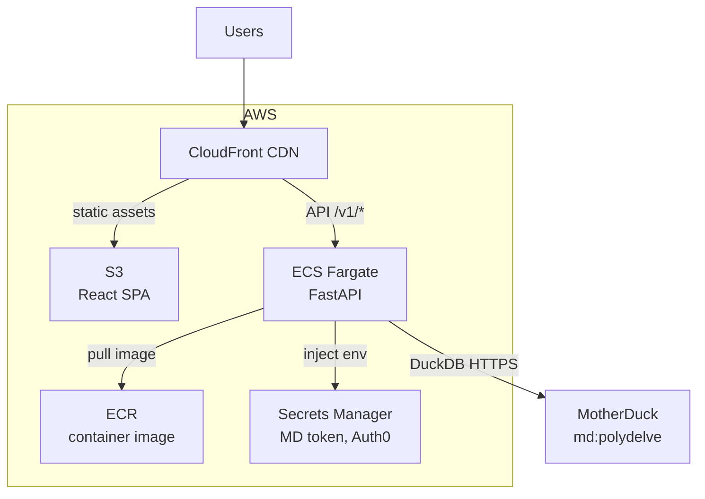

## Architecture



## Auth

All write endpoints require an Auth0 JWT in the `Authorization: Bearer <token>` header. Read endpoints are public.

---

## Packages

### `GET /packages`

Top npm and PyPI packages with CVE history and EPSS data.

| Param | Default | Description |
|-------|---------|-------------|
| `ecosystem` | — | `npm` or `PyPI` |
| `sector` | — | Filter by sector label |
| `limit` | `50` | Max results |

### `GET /packages/{name}/epss`

EPSS time-series for all CVEs associated with a package.

---

## Contracts

### `POST /contracts`

Buy a contract. Deducts `purchase_price` from the authenticated user's Schmeckle balance.

```json
{
  "package_name": "lodash",
  "ecosystem": "npm",
  "cvss_threshold": 7.0,
  "epss_threshold": 0.1,
  "purchase_price": 100,
  "duration_days": 30
}
```

Response includes `max_payout` and `multiplier`.

### `GET /contracts/me`

All contracts for the authenticated user, with resolution status.

---

## Markets

### `GET /markets`

Curated markets with package and contract data.

### `GET /markets/{id}`

Single market by ID.

---

## News

### `GET /news`

Security news feed.

| Param | Default | Description |
|-------|---------|-------------|
| `page` | `1` | Page number |
| `page_size` | `20` | Items per page |

---

## Users

### `GET /users/me`

Authenticated user's profile, Schmeckle balance, and contract count.

### `POST /users`

Create account (called automatically on first Auth0 login). Grants 1000 Schmeckles.

---

## Leaderboard

### `GET /leaderboard`

Top users by prediction accuracy score.
