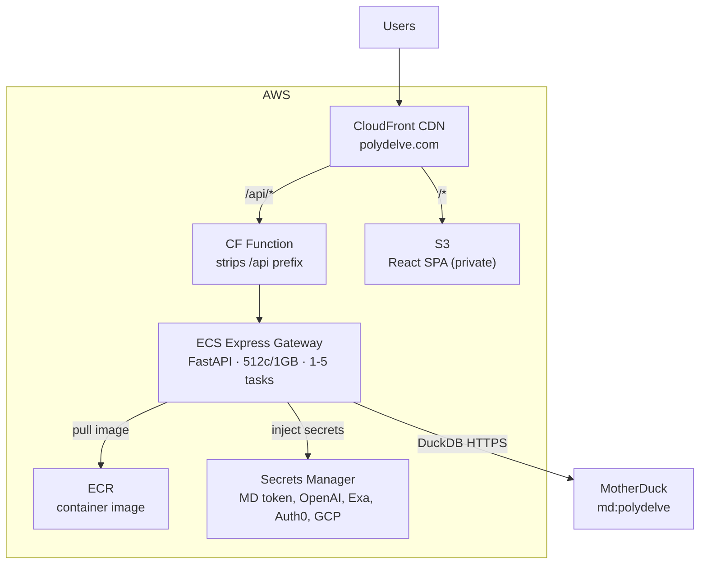

## Architecture



## Auth

All write endpoints and `/packages` require an Auth0 JWT in the `Authorization: Bearer <token>` header. Public endpoints: `/news`, `/featured-contracts`, `/users/leaderboard`, `/companies`, `/markets`.

---

## Packages

### `GET /packages`

Top npm and PyPI packages with CVE history and EPSS data.

| Param | Default | Description |
|-------|---------|-------------|
| `ecosystem` | — | `npm` or `PyPI` |
| `sector` | — | Filter by sector label |
| `limit` | `50` | Max results |

---

## Contracts

### `POST /contracts/simulate`

Preview payout curve for a contract configuration without buying. Returns probability, payout, and a simulated sell-value curve.

### `POST /contracts/quote`

Get a price quote for a contract configuration. Returns `purchase_price`, `max_payout`, and `opening_probability`.

### `POST /contracts`

Buy a contract. Deducts `purchase_price` from the authenticated user's Schmeckle balance.

```json
{
  "package_name": "lodash",
  "ecosystem": "npm",
  "cvss_threshold": 7.0,
  "epss_threshold": 0.1,
  "purchase_price": 100,
  "duration_days": 30
}
```

Response includes `max_payout` and `multiplier`.

### `GET /contracts/me`

All contracts for the authenticated user, with resolution status.

### `GET /contracts/user/{user_id}`

All contracts for a specific user (public).

### `POST /contracts/{contract_id}/sell`

Sell an open contract early at the current time-decayed value.

---

## Featured Contracts

### `GET /featured-contracts`

Auto-generated featured markets ranked by `relevancy_score`. These are the contracts surfaced on the home feed.

---

## News

### `GET /news`

Security news feed. Results ordered by `published_date DESC, relevancy_score DESC` — higher-signal articles appear first within each day.

| Param | Default | Description |
|-------|---------|-------------|
| `page` | `1` | Page number |
| `page_size` | `20` | Items per page |
| `severity` | — | Filter by severity (e.g. `HIGH`, `CRITICAL`) |
| `exploit_status` | — | Filter by exploit status |

---

## Users

### `GET /users/me`

Authenticated user's profile, Schmeckle balance, and contract count.

Calling `GET /users/me` with a valid Auth0 JWT automatically creates the account on first login and grants 1000 Schmeckles.

---

## Leaderboard

### `GET /users/leaderboard`

Top users by prediction accuracy score.

### `GET /users/leaderboard/{user_id}/timeline`

Schmeckle balance history for a specific user.
