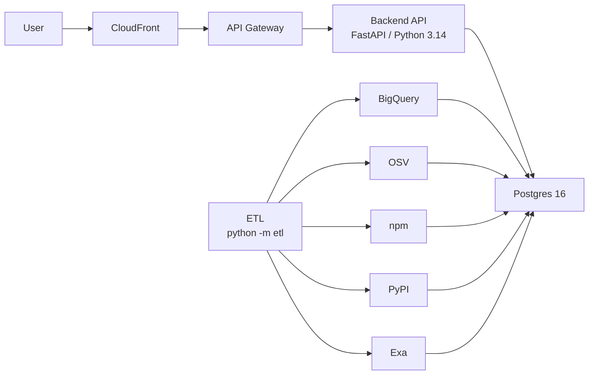

## Frontend

React/Next.js app served via CloudFront. Runs on port 5173 locally. Talks exclusively to the Backend API — no direct database access. Auth0 handles login; the frontend exchanges tokens with the backend on authenticated routes.

## Backend

FastAPI on Python 3.14, managed with `uv`. Runs on port 8000 locally. Sits behind AWS API Gateway in production. Responsible for all business logic, query routing, and Auth0 token verification.

## Database

Postgres 16. Docker-managed locally; AWS RDS in production. Schema versioned and migrated via Alembic. Single source of truth for all app-facing data including packages, CVEs, EPSS scores, and news.

## ETL

Jobs run as `python -m etl <job>`. No AWS EventBridge or Step Functions — triggering is via external scheduler (cron, CI) or manual invocation. Data sources: EPSS via BigQuery bulk export (not the FIRST API), CVE resolution via OSV, download counts via npm and PyPI APIs, and news via Exa.

## Auth

Auth0 for all authentication. The frontend initiates the OAuth flow; the backend validates JWTs on protected endpoints. No custom auth logic in the codebase.
