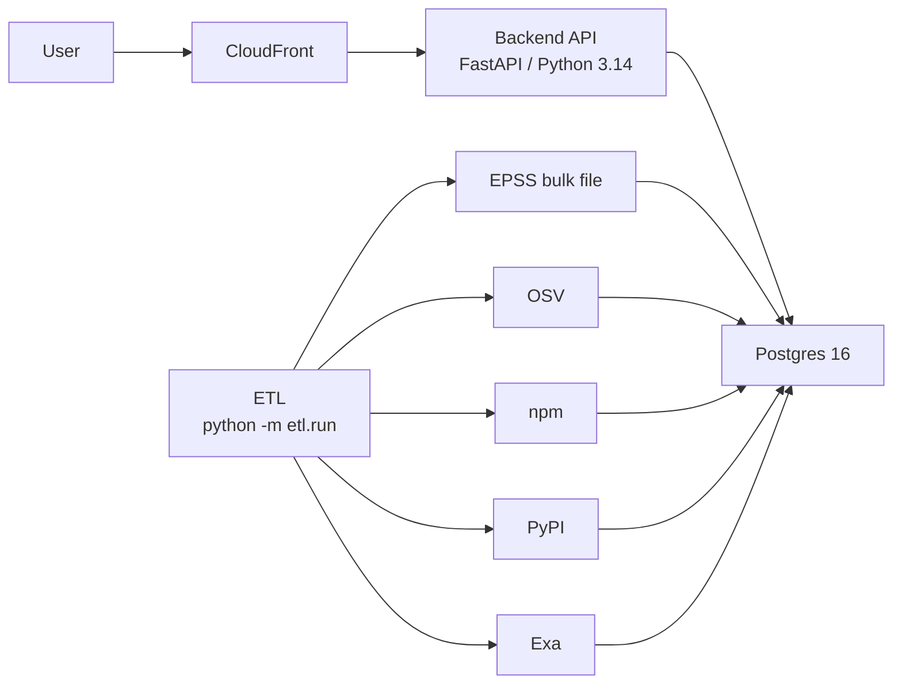

```mermaid
flowchart LR
  User --> CloudFront
  CloudFront --> Backend["Backend API\nFastAPI / Python 3.14"]
  Backend --> Postgres["Postgres 16"]

  ETL["ETL\npython -m etl.run"] --> EPSS["EPSS bulk file"]
  ETL --> OSV
  ETL --> npm
  ETL --> PyPI
  ETL --> Exa
  EPSS & OSV & npm & PyPI & Exa --> Postgres
```

## Frontend

React (Vite) SPA, built to static files on S3 and served via CloudFront. Runs on port 5173 locally. Talks exclusively to the Backend API — no direct database access. Auth0 handles login; the frontend exchanges tokens with the backend on authenticated routes.

## Backend

FastAPI on Python 3.14, managed with `uv`. Runs on port 8000 locally. In production it runs on ECS Fargate (ECS Express Gateway) behind CloudFront, which proxies `/api/*` to it. Responsible for all business logic, query routing, and Auth0 token verification.

## Database

Postgres 16. Docker-managed locally; AWS RDS in production. Schema versioned and migrated via Alembic. Single source of truth for all app-facing data including packages, CVEs, EPSS scores, and news.

## ETL

Jobs run as `python -m etl.run <job>`. In production an EventBridge Scheduler rule runs the `refresh` job on a Fargate task at 9am, 12pm and 5pm ET (no Step Functions); jobs can also be run manually. Data sources: EPSS via the daily bulk file (not per-CVE API calls), CVE resolution and MAL advisories via OSV, download counts via npm and PyPI APIs, and news via Exa.

## Auth

Auth0 for all authentication. The frontend initiates the OAuth flow; the backend validates JWTs on protected endpoints. No custom auth logic in the codebase.
