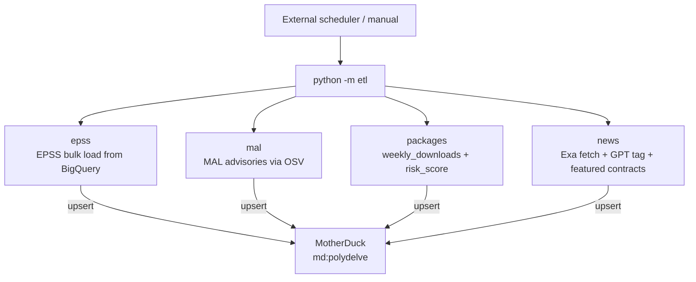

## Architecture

ETL runs via `python -m etl <job>` (see `backend/etl/run.py`). Jobs are triggered manually or via an external scheduler (cron, CI, etc.) — there is no AWS EventBridge or Step Functions orchestration.



## Sources

| Source | What it provides |
|--------|-----------------|
| npm / PyPI APIs | Top packages by weekly downloads |
| OSV API | CVE advisories per package |
| BigQuery (FIRST/EPSS) | Daily exploitation probability scores via bulk export |
| Exa | Security news articles |
| GPT (gpt-5.4-mini) | News analysis — extracts packages, sector labels, company mentions, relevancy score |

## Package universe

`scripts/seed_top_packages.py` fetches the top 500 npm and top 500 PyPI packages by download count and seeds the `packages` table.

Run once to bootstrap, then periodically to catch new entrants:

```bash
make enrich-packages
```

## CVE history

`scripts/ingest_epss_history.py` bulk-loads historical EPSS scores. `scripts/refresh_epss.py` runs daily to pick up new CVE disclosures and updated scores.

Recommended bootstrap order for a fresh database:

```bash
make build-cve-history      # OSV CVE data for all packages
make enrich-packages        # download stats + descriptions
make enrich-sectors         # heuristic sector classification
make classify-sectors-llm   # LLM sector classification (optional, slower)
make etl-news               # fetch security news + generate featured contracts
```

## News pipeline

```
Exa search (security queries)
    ↓
GPT structured extraction (GptAnalysis)
    → company_labels, sector_labels, affected_packages[], relevancy_score
    ↓
news table (deduped by URL + semantic similarity)
    ↓
featured_contracts generated + reranked by relevancy_score
    ↓
GET /news + GET /featured-contracts → frontend
```

`make etl-news` runs the full fetch + extract + store + featured-contracts cycle. Run daily via an external cron or manually before demos.

## Contract resolution

EPSS refresh (`make etl-epss`) checks open contracts against new OSV data. Any contract whose package has a qualifying new CVE (CVSS ≥ threshold, within duration) is resolved YES automatically.
