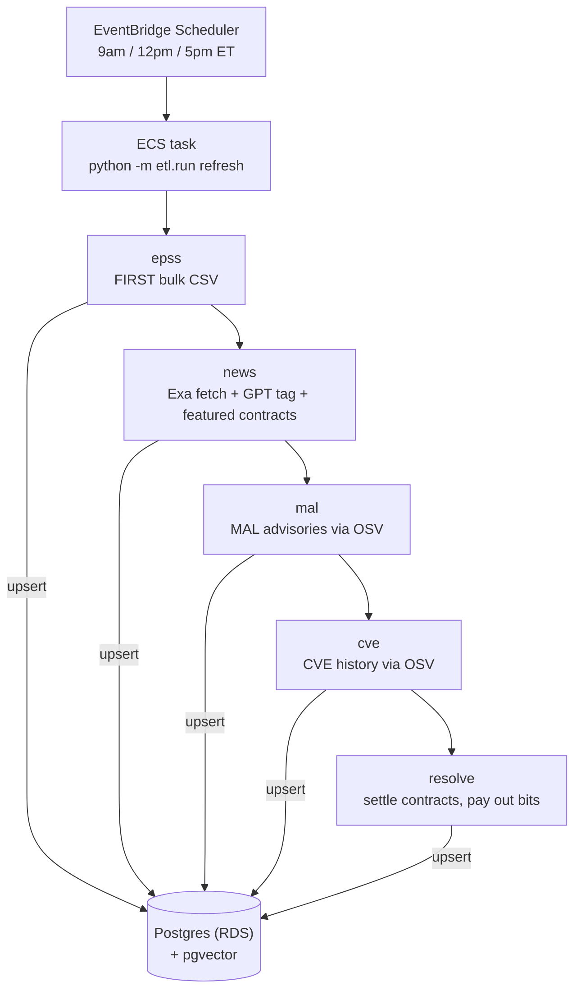

## Architecture

ETL runs via `python -m etl.run <job>` (see `backend/etl/run.py`). In production an EventBridge Scheduler rule starts the `refresh` job as a one-off ECS Fargate task at 9am, 12pm and 5pm ET (`terraform/etl.tf`). Individual jobs can also be run by hand with `make etl-*`.


```mermaid
flowchart TD
  Sched["EventBridge Scheduler\n9am / 12pm / 5pm ET"] --> Task["ECS task\npython -m etl.run refresh"]

  Task --> T1["epss\nFIRST bulk CSV"]
  T1 --> T2["news\nExa fetch + GPT tag + featured contracts"]
  T2 --> T3["mal\nMAL advisories via OSV"]
  T3 --> T4["cve\nCVE history via OSV"]
  T4 --> T5["resolve\nsettle contracts, pay out bits"]

  T1 & T2 & T3 & T4 & T5 --"upsert"--> PG[("Postgres (RDS)\n+ pgvector")]
```

## Sources

| Source | What it provides |
|--------|-----------------|
| npm downloads API / BigQuery PyPI dataset | Weekly download counts |
| OSV bulk zips | CVE and MAL advisories per package |
| FIRST bulk CSV (`epss_scores-DATE.csv.gz`) | Daily exploitation probability scores |
| Exa | Security news articles |
| GPT (gpt-5.4-mini) | News analysis — extracts packages, sector labels, company mentions, relevancy score |

## Package universe

The `seed` job derives the package universe from `cve_history` (npm and PyPI packages with at least one CVE), loads the latest EPSS score from `epss_history`, refreshes download counts and computes `risk_score`.

```bash
make etl-seed
```

Afterwards, `make etl-packages` refreshes metadata for existing packages.

## CVE history

`scripts/ingest_epss_history.py` bulk-loads historical EPSS scores from the FIRST daily CSVs (`make ingest-epss-history`). The `epss` job (`etl/jobs/epss.py`) runs on every `refresh` to pick up new scores, and the `cve` job re-reads OSV for new CVE disclosures.

Recommended bootstrap order for a fresh database:

```bash
make build-cve-history      # OSV CVE data for all packages
make ingest-epss-history    # historical EPSS snapshots
make etl-seed               # packages, downloads, risk_score
make etl-news               # fetch security news + generate featured contracts
```

## News pipeline

```
Exa search (security queries)
    ↓
GPT structured extraction (GptAnalysis)
    → company_labels, sector_labels, affected_packages[], relevancy_score
    ↓
news table (deduped by URL + semantic similarity)
    ↓
featured_contracts generated + reranked by relevancy_score
    ↓
GET /news + GET /featured-contracts → frontend
```

`make etl-news` runs the full fetch + extract + store + featured-contracts cycle. It also runs as part of the scheduled `refresh`.

## Contract resolution

`make etl-epss` does not resolve contracts. Resolution is the last step of `refresh` (or `python -m etl.run resolve` / `make resolve-contracts`). `features/settlement.py` checks open contracts against `cve_history`, `epss_history` and `mal_advisories`; a contract whose package has a qualifying new CVE (CVSS ≥ threshold, within duration), an EPSS crossing or a MAL advisory is resolved YES automatically.
