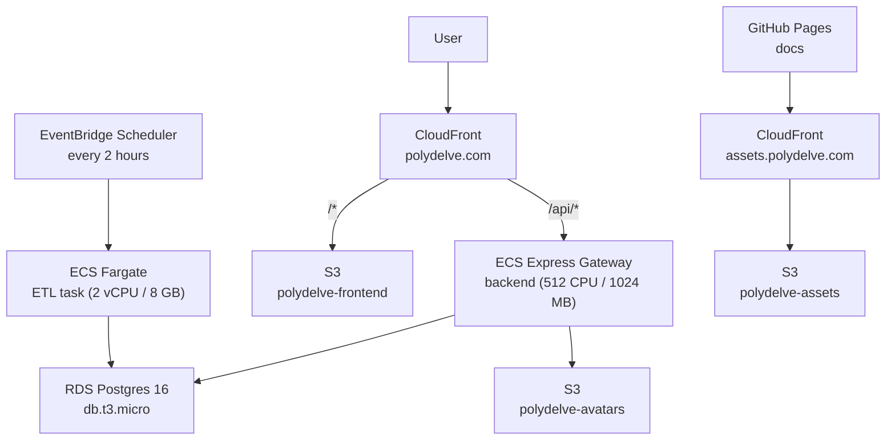

All infrastructure is managed by Terraform in `terraform/`. Provider: `hashicorp/aws ~> 6.0`, Terraform `>= 1.5`. Every resource is tagged `Project = polydelve` via `default_tags`.

## Architecture



## Terraform layout

| File | What it manages |
|---|---|
| `main.tf` | Provider config, default tags |
| `ecs.tf` | ECS cluster, backend Express Gateway service, CloudWatch logs |
| `ecr.tf` | ECR repo for the backend image, lifecycle policy (keep last 10) |
| `rds.tf` | RDS Postgres 16, subnet group, security group, Secrets Manager entry |
| `frontend.tf` | S3 frontend bucket, CloudFront distribution, API prefix-strip function |
| `s3_avatars.tf` | S3 avatar bucket, public-read policy for `/avatars/*`, presign IAM role |
| `s3_assets.tf` | S3 assets bucket (private + OAC), CloudFront at `assets.polydelve.com`, CI IAM user |
| `acm.tf` | ACM cert covering `polydelve.com`, `www`, `assets` — DNS-validated via Route 53 |
| `dns.tf` | Route 53 zone, apex + www + assets A/CNAME records |
| `iam.tf` | ECS execution role, infrastructure role, task role |
| `secrets.tf` | Secrets Manager entries for all app secrets |
| `etl.tf` | Fargate ETL task definition, EventBridge Scheduler (every 2 hours) |
| `variables.tf` | Input variables — secrets passed via `TF_VAR_*`, never committed |

## Resources

### Compute — ECS Express Gateway

The backend runs as an ECS Express Gateway Service (`aws_ecs_express_gateway_service`). Express Gateway manages the ALB, target groups, and autoscaling automatically — no `aws_lb` or `aws_ecs_service` resources needed.

| Setting | Value |
|---|---|
| CPU / memory | 512 CPU units / 1024 MB |
| Min tasks | 1 |
| Max tasks | 5 |
| Autoscaling metric | Average CPU, target 70% |
| Health check | `GET /health` |
| Deploy | Rolling (`wait_for_steady_state = true`) |

Secrets (Database URL, API keys, Auth0 config) are injected from Secrets Manager at task startup — never in environment variables directly.

### Container registry — ECR

Single repository `polydelve-backend`. Image scanning on push is enabled. Lifecycle policy keeps the last 10 images and expires the rest.

### Database — RDS Postgres 16

| Setting | Value |
|---|---|
| Instance class | `db.t3.micro` (configurable via `var.db_instance_class`) |
| Storage | 20 GB gp3 |
| Database name | `polydelve` |
| Backups | Disabled (`backup_retention_period = 0`) |
| Deletion protection | Enabled |
| Final snapshot | Created on destroy (`polydelve-final`) |

Runs in the default VPC. Security group allows port 5432 from within the VPC only — ECS tasks reach it internally; no public access by default.

Connection string is stored in Secrets Manager as `polydelve/database_url` and injected into both the backend container and ETL task.

### Frontend — S3 + CloudFront

Static React build deployed to `polydelve-frontend` (private S3, OAC). CloudFront distribution at `polydelve.com` / `www.polydelve.com`:

- **`/api/*`** — forwarded to the ECS backend; a CloudFront Function strips the `/api` prefix before forwarding
- **`/*`** — served from S3
- SPA fallback: 403/404 → `index.html`

### Docs assets — S3 + CloudFront

Large docs assets (video, screenshots) live in `polydelve-assets` (private S3, OAC) served via CloudFront at `assets.polydelve.com`. The docs site (GitHub Pages) references these via absolute CDN URLs.

CI syncs `docs/public/` to S3 on every docs deploy using the `polydelve-ci-assets` IAM user (S3 PutObject/ListBucket only). Large files (video) are uploaded manually and not deleted by CI sync.

### Avatar uploads — S3

`polydelve-avatars` is public-read on the `avatars/*` prefix. The backend task role has `s3:PutObject` on `avatars/*` only, used to generate presigned PUT URLs. Uploads go directly from the browser to S3.

### ETL scheduling — EventBridge Scheduler

The ETL Fargate task runs on a `rate(2 hours)` schedule via EventBridge Scheduler (`aws_scheduler_schedule`). It runs the `hourly` composite job by default (EPSS refresh + news update + MAL advisories). The command can be overridden per-run via ECS task override to run any individual ETL job.

| Setting | Value |
|---|---|
| CPU / memory | 2 vCPU / 8 GB |
| Schedule | Every 2 hours (±10 min flexible window) |
| Retry | 2 attempts, max event age 1 hour |
| Logs | CloudWatch `/ecs/polydelve/etl`, 14-day retention |

### DNS and TLS

Route 53 manages `polydelve.com`. Single ACM certificate covers `polydelve.com`, `www.polydelve.com`, and `assets.polydelve.com` — DNS-validated automatically via Terraform (`aws_acm_certificate_validation`).

## Applying changes

```bash
cd terraform
terraform plan
terraform apply
```

Secrets are never in the repo. Pass them via environment before running:

```bash
export TF_VAR_db_password=...
export TF_VAR_openai_api_key=...
# etc — see variables.tf for the full list
```

State is local (`terraform.tfstate`) — gitignored.

## RDS access

Port 5432 is closed to the public by default. To connect to prod:

1. Add a temporary inbound rule to the `polydelve-rds` security group: port `5432`, your current public IP.

2. Add a `polydelve-prod` connection to `~/.config/nvim/lua/plugins/dbee.lua`:

   ```lua
   {
     name = "polydelve-prod",
     type = "postgres",
     url = "postgresql://polydelve:<password>@<rds-endpoint>:5432/polydelve",
   }
   ```

3. Connect via `:Dbee` as normal.

4. **Remove the security group rule when done.** Never leave 5432 open to a public IP.

The RDS endpoint is available as a Terraform output: `terraform output rds_endpoint`.
