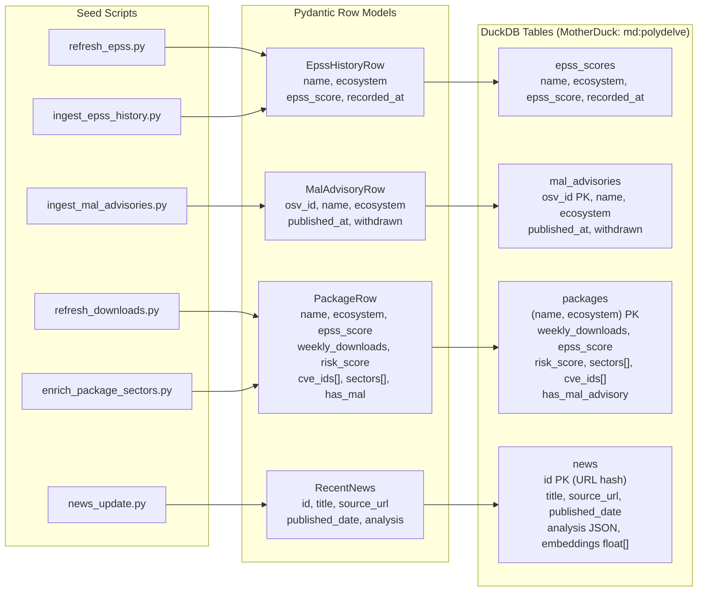

## Data Model



## Prerequisites

- Python 3.14+, [uv](https://docs.astral.sh/uv/)
- Node.js 20+, npm

## Install

```bash
make be-install    # backend deps via uv
make fe-install    # frontend deps via npm
```

## Environment variables

Copy the secrets template and fill in keys:

```bash
cp backend/secrets/.env.example backend/secrets/.env
```

| Variable | Service | Required for |
|----------|---------|-------------|
| `EXA_API_KEY` | Exa | News fetch |
| `GEMINI_API_KEY` | Google Gemini | News tagging, sector LLM |
| `OPENAI_API_KEY` | OpenAI | Sector classification fallback |
| `MOTHERDUCK_TOKEN` | MotherDuck | Production DB (not needed locally) |
| `AUTH0_DOMAIN` | Auth0 | Auth (can use dev tenant) |
| `AUTH0_AUDIENCE` | Auth0 | Auth |

For local dev the app runs against a local DuckDB file — no MotherDuck token needed.

## Run

```bash
make dev     # backend (port 8000) + frontend (port 5173) concurrently
make be      # backend only
make fe      # frontend only
```

## Useful make targets

```
make news-update            fetch and store latest security news
make build-cve-history      pull CVE data from OSV for all packages
make enrich-packages        add download stats and descriptions
make enrich-sectors         heuristic sector classification
make classify-sectors-llm   LLM sector classification (slower)
make refresh-epss           update EPSS scores + resolve contracts
make be-test                run backend test suite
make lint                   lint frontend TypeScript
```

Run `make help` to see all targets.
