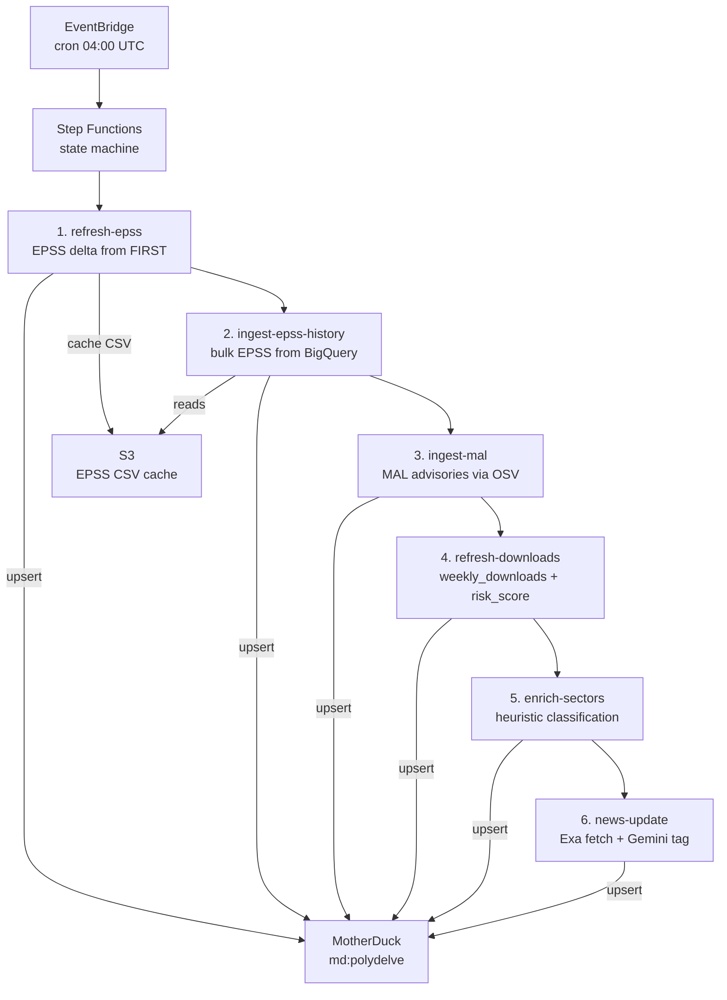

## Architecture



## Sources

| Source | What it provides |
|--------|-----------------|
| npm / PyPI APIs | Top packages by weekly downloads |
| OSV API | CVE advisories per package |
| FIRST.org EPSS | Daily exploitation probability scores |
| Exa | Security news articles |
| Gemini | News tagging — extracts package names, sector labels, company mentions |

## Package universe

`scripts/seed_top_packages.py` fetches the top 500 npm and top 500 PyPI packages by download count and seeds the `packages` table.

Run once to bootstrap, then periodically to catch new entrants:

```bash
make enrich-packages
```

## CVE history

`scripts/ingest_epss_history.py` bulk-loads historical EPSS scores. `scripts/refresh_epss.py` runs daily to pick up new CVE disclosures and updated scores.

Recommended bootstrap order for a fresh database:

```bash
make build-cve-history      # OSV CVE data for all packages
make enrich-packages        # download stats + descriptions
make enrich-sectors         # heuristic sector classification
make classify-sectors-llm   # LLM sector classification (optional, slower)
make news-update            # pull latest security news
```

## News pipeline

```
Exa search (security queries)
    ↓
Gemini extraction
    → company_labels, sector_labels, packages[]
    ↓
news table (deduped by URL)
    ↓
GET /news → frontend
```

`make news-update` runs the full fetch + extract + store cycle. Run on a cron or manually before demos.

## Contract resolution

EPSS refresh (`make refresh-epss`) also checks open contracts against new OSV data. Any contract whose package has a qualifying new CVE (CVSS ≥ threshold, within duration) is resolved YES automatically.
