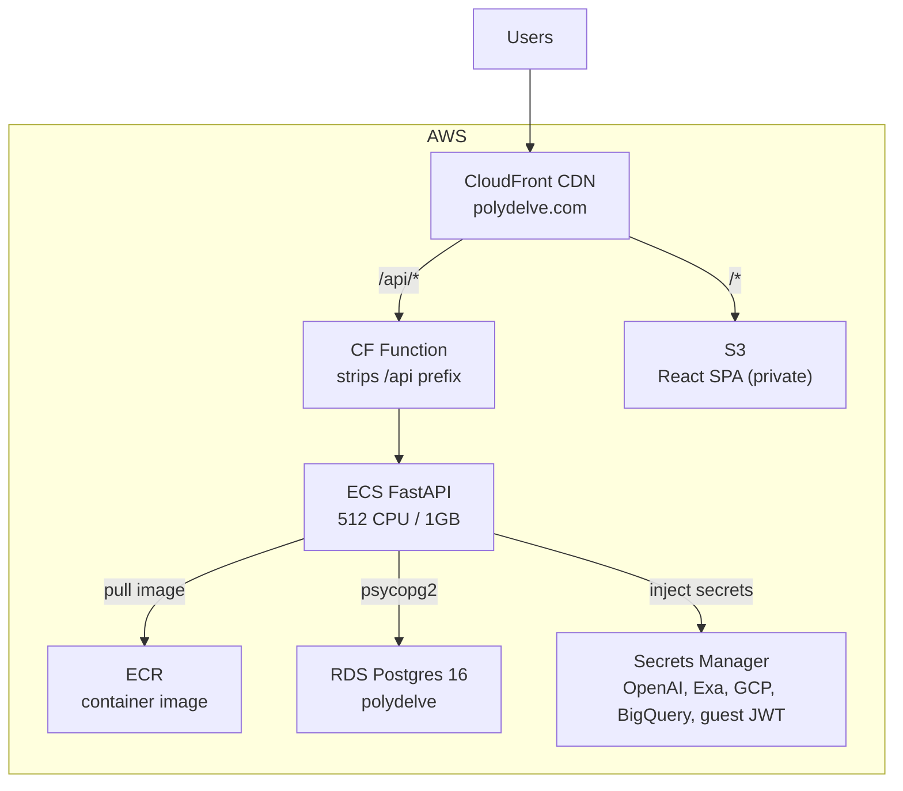

## Architecture

## Auth

Three tiers:

- **Public** (no token needed): `GET /health`, `POST /auth/guest`, `GET /news`, `GET /companies`, `GET /markets`, `GET /markets/{market_id}`, `GET /users/leaderboard`, `GET /featured-contracts`.
- **Browse** (never rejected, token optional): `/packages`, `/events`, `/etf/parse`, `/etf/quote`, `/etf/simulate`, `/contracts/simulate`, `/contracts/quote`, `/contracts/user/{user_id}`, `/users/leaderboard/{user_id}/timeline`. These accept an Auth0 JWT, a guest token, or no token.
- **Auth0 only** (`Authorization: Bearer <token>`): everything that writes or reads private state. Guest tokens are rejected.

### `POST /auth/guest`

Mints a short-lived HS256 guest token for logged-out browsing. Returns `token`, `expires_in` (seconds, default 604800), and `token_type`. Guest tokens cannot place bets.

### `GET /health`

Returns `{"status": "ok"}`.

---

## Packages

### `GET /packages`

Paginated npm and PyPI packages with CVE history and EPSS data.

| Param | Default | Description |
|-------|---------|-------------|
| `ecosystem` | — | `npm` or `PyPI` |
| `sector` | — | Filter by sector label |
| `has_cves` | — | Only packages with (or without) CVEs |
| `latest_cve_days` | — | Only packages with a CVE in the last N days |
| `search` | — | Package name prefix |
| `severity` | — | Worst CVSS band: `critical` (>= 9), `high` (>= 7), `medium` (>= 4), `low` |
| `min_epss` / `max_epss` | — | Current EPSS score bounds (0-1) |
| `mal` | — | `true` = only packages with an OSV MAL advisory |
| `min_downloads` | — | Minimum weekly downloads |
| `sort` | `risk_score` | `risk_score`, `weekly_downloads`, `epss_score`, or `num_cves` |
| `page` | `1` | Page number |
| `page_size` | `50` | Items per page (max 500) |

### `GET /packages/{ecosystem}/{name}`

Detail for a single package. `name` may contain slashes (scoped npm packages).

---

## Events

### `GET /events`

Paginated feed of CVSS, EPSS-crossing, and malicious-advisory events, limited to packages that can be bet on.

| Param | Default | Description |
|-------|---------|-------------|
| `window` | `dense` | `dense` = last 30 days, `shallow` = all time |
| `type` | — | `cvss`, `epss`, `mal` (repeatable) |
| `ecosystem` | — | `npm` or `PyPI` |
| `search` | — | Package name contains |
| `severity` | — | `critical`, `high`, `medium`, `low` (CVSS events only) |

Also takes standard pagination parameters.

---

## Contracts

### `POST /contracts/simulate`

Preview payout curve for a contract configuration without buying. Browse tier.

### `POST /contracts/quote`

Get a price quote for a contract configuration. Browse tier.

### `POST /contracts`

Buy a contract (returns `201`). Auth0 only. Deducts the purchase price from the user's bits balance. Request and response shapes: `BuyRequest` and `BuyResponse` on the [Models](/docs/reference/models) page.

### `GET /contracts/me`

All contracts for the authenticated user, with resolution status. Auth0 only.

### `GET /contracts/user/{user_id}`

All contracts for a specific user. Browse tier.

---

## ETF Contracts

### `POST /etf/parse`

Parse a dependency manifest. Body: `{"filename": ..., "content": ...}`. Returns `422` for unsupported or invalid manifests.

### `POST /etf/quote`

Price a basket of packages. Browse tier.

### `POST /etf/simulate`

Preview payout curve for a basket. Browse tier.

### `POST /etf`

Buy an ETF contract (returns `201`). Auth0 only.

### `GET /etf/me`

The authenticated user's ETF contracts. Auth0 only.

---

## Featured Contracts

### `GET /featured-contracts`

Auto-generated featured markets surfaced on the home feed. Public.

---

## News

### `GET /news`

Security news feed. Public.

| Param | Default | Description |
|-------|---------|-------------|
| `page` | `1` | Page number |
| `page_size` | `20` | Items per page |
| `severity` | — | Filter by severity (e.g. `HIGH`, `CRITICAL`) |
| `exploit_status` | — | Filter by exploit status |

---

## Companies and Markets

### `GET /companies`

Companies with a title, logo, and security grade. Public.

### `GET /markets`

Markets filtered by `status` (default `open`). Public.

### `GET /markets/{market_id}`

A single market. Public.

### `POST /markets`

Create a market (returns `201`). Auth0 only. `duration_days` must be between 1 and 31.

### `POST /bets`

Place a bet on a market (returns `201`). Auth0 only.

---

## Users

### `GET /users/me`

Authenticated user's profile and bits balance. Auth0 only.

Calling it with a valid Auth0 JWT creates the account on first login and grants 1000 bits.

### `PATCH /users/me`

Update the authenticated user's profile. Auth0 only.

### `GET /users/me/avatar-upload-url`

Get an upload URL for the user's avatar (S3). Auth0 only.

### `GET /users/{user_id}`

Fetch a user record. Auth0 only; only the authenticated user's own ID is allowed.

---

## Leaderboard

### `GET /users/leaderboard`

Paginated leaderboard. Public. Params: `page` (default `1`), `page_size` (default `50`, max 100), `search`.

### `GET /users/leaderboard/{user_id}/timeline`

Bits balance history for a specific user. Browse tier.
